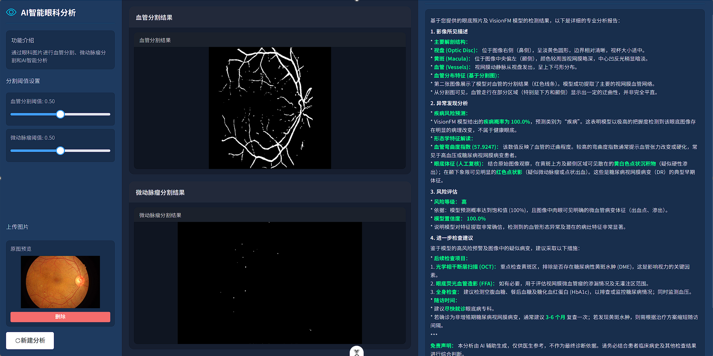

# VisionFM 眼科智能分析平台

<p align="center">
  <strong>基于 VisionFM 视觉基础模型的眼底图像多任务分析与 Web 服务原型</strong>
</p>

<p align="center">
  <a href="#项目定位与使用范围">使用范围</a> ·
  <a href="#功能概览">功能</a> ·
  <a href="#快速开始">快速开始</a> ·
  <a href="#模型权重">模型权重</a> ·
  <a href="#api-服务">API</a> ·
  <a href="#项目结构">项目结构</a> ·
  <a href="#文档">文档</a>
</p>

> **研究与教学用途**：本项目用于眼科人工智能研究、教学和原型验证，不构成医疗器械、临床诊断或治疗建议。模型输出须由具备资质的专业人员结合完整临床信息审阅。



## 项目简介

本项目以 [VisionFM](visionfm/README_zh.md) 为视觉表征基础，构建了一个面向眼底图像的多任务智能分析原型。系统将模型推理能力封装为 FastAPI 服务，并提供 Vue 3 可视化界面，实现从图像上传、任务与参数选择，到结构化结果和辅助报告展示的完整流程。

VisionFM 是用于通用眼科人工智能的视觉基础模型，原始工作覆盖眼底彩照、OCT、FFA、裂隙灯等多种眼科成像模态。本仓库当前的 Web 原型主要围绕**眼底图像（Fundus）**展开，并结合专项微动脉瘤分割模型，形成“**通用基础模型 + 专项病灶模型 + 多模态大模型辅助分析**”的技术链路。

> **运行时依赖说明**：当前 Web 系统的启动与推理仅依赖 [`backend/`](backend/) 和 [`frontend/`](frontend/)；`start.bat`、`start.sh` 及后端服务不会在运行时调用 `visionfm/` 目录。保留 [`visionfm/`](visionfm/) 是为了展示项目所依据的 VisionFM 训练、微调、评估与命令行推理流程，便于复现研究过程、学习代码结构，以及后续自行训练或更新下游模型。若只部署现有 Web 原型，可不使用该目录中的训练脚本。


## 功能概览

- **眼底血管分割**：基于 VisionFM 编码器与 UNETR 解码头输出血管掩码。
- **微动脉瘤分割**：集成面向 IDRiD 数据集的专项模型，输出病灶掩码、病灶数量、面积和占比。
- **二分类与多分类**：支持加载训练完成的分类 checkpoint，适用于疾病筛查、分级等自定义任务。
- **AI 智能分析**：可选接入阿里云百炼 DashScope 多模态模型，融合原图与本地模型结果生成自然语言分析报告。
- **Web 可视化交互**：支持上传图片、选择任务、调整阈值与模型路径、查看原图/掩码/分类结果与报告。
- **开放 API**：提供 FastAPI 自动文档、健康检查、模型信息与任务列表接口，便于二次集成。
- **训练与微调代码**：保留 VisionFM 的预训练、微调、特征提取及下游任务解码器训练实现。

## 系统架构

```text
┌─────────────────────────────────────────────────────────────────┐
│                     Vue 3 + Vite 前端（:5173）                  │
│  图像上传 · 任务选择 · 参数配置 · 结果可视化 · 报告展示          │
└─────────────────────────────┬───────────────────────────────────┘
                              │ HTTP / JSON / multipart
┌─────────────────────────────▼───────────────────────────────────┐
│                    FastAPI 后端服务（:8000）                    │
│  文件校验 · 模型缓存 · 任务路由 · Base64 结果封装 · API 文档     │
└──────────────┬───────────────────────────────┬──────────────────┘
               │                               │
┌──────────────▼─────────────┐   ┌─────────────▼────────────────┐
│ 本地视觉模型推理            │   │ 可选：多模态大模型辅助分析    │
│ VisionFM / UNETR / MSRNet  │   │ DashScope（百炼）             │
│ 分割 · 分类 · 病灶统计      │   │ 结构化结果 + 自然语言报告     │
└────────────────────────────┘   └──────────────────────────────┘
```

## 技术栈

| 层级 | 技术 |
| --- | --- |
| 前端 | Vue 3、TypeScript、Vite、Element Plus、Axios |
| 后端 | Python、FastAPI、Uvicorn、Pydantic |
| 深度学习 | PyTorch、Torchvision、MONAI、Einops |
| 图像处理 | Pillow、OpenCV、NumPy |
| 可选报告能力 | 阿里云百炼 DashScope 多模态模型 |
| 基础模型 | VisionFM（Vision Transformer 编码器） |

## 快速开始

### 1. 前置条件

- Python **3.8+**（建议使用与 PyTorch/CUDA 匹配的独立虚拟环境）
- Node.js **20.19+** 或 **22.12+**
- 可选：NVIDIA GPU、CUDA 与相匹配的 PyTorch 版本
- 可选：阿里云百炼 API Key（仅 AI 智能分析功能需要）

> CPU 可用于验证服务流程，但视觉模型推理通常建议使用 GPU。

### 2. 克隆并进入项目

```bash
git clone <your-repository-url>
cd visonFM_
```

### 3. 配置后端环境

```bash
cd backend
python -m venv venv

# Windows PowerShell
.\venv\Scripts\Activate.ps1

# Linux / macOS
# source venv/bin/activate

pip install -r requirements.txt
```

如需使用 CUDA，请根据本机 CUDA 版本从 PyTorch 官方渠道安装对应的 `torch` 与 `torchvision`，再安装其余依赖。

### 4. 配置模型权重

将所需模型文件放置到 `backend/` 下的对应目录；详情见 [模型权重](#模型权重)。至少应准备 Fundus 预训练权重和与所用任务相匹配的 checkpoint。

### 5. 配置环境变量（可选）

根目录提供了 `.env.example`。若需启用 AI 智能分析，将其内容配置到运行后端的环境中，例如：

```dotenv
DASHSCOPE_API_KEY=your_api_key_here
DASHSCOPE_MODEL=qwen-vl-chat-v1
HOST=0.0.0.0
PORT=8000
```

未配置 `DASHSCOPE_API_KEY` 时，基础分割和分类能力仍可使用；AI 分析接口会提示服务未配置。

### 6. 启动服务

**方式一：使用启动脚本（Windows）**

先完成后端虚拟环境和前端依赖安装，然后在仓库根目录运行：

```bat
start.bat
```

**方式二：手动启动（推荐用于开发）**

终端 1：

```bash
cd backend
# Windows: .\venv\Scripts\Activate.ps1
# Linux / macOS: source venv/bin/activate
python main.py
```

终端 2：

```bash
cd frontend
npm install
npm run dev
```

服务启动后访问：

| 服务 | 地址 |
| --- | --- |
| Web 界面 | `http://localhost:5173` |
| API 根信息 | `http://localhost:8000/` |
| Swagger API 文档 | `http://localhost:8000/docs` |
| 健康检查 | `http://localhost:8000/health` |

### 7. 验证安装

```bash
curl http://localhost:8000/health
```

或打开 Swagger 文档，在浏览器中直接上传测试图片并调用接口。

## 模型权重

模型权重通常体积较大，**未提交到 Git 仓库**。后端按相对 `backend/` 工作目录解析默认路径，请按下列目录准备文件：

```text
backend/
├── pretrain_weights/
│   └── VFM_Fundus_weights.pth              # Fundus 预训练权重（核心）
└── checkpoints/
    ├── seg/
    │   └── checkpoint_108_linear.pth       # 血管分割解码器权重
    ├── idrid_ma/
    │   └── net.pt7                         # IDRiD 微动脉瘤分割权重
    └── single_cls/
        └── <your-classifier>.pth           # 自训练的分类权重（可选）
```

| 能力 | 预训练权重 | 任务权重 |
| --- | --- | --- |
| 血管分割 | `VFM_Fundus_weights.pth` | `checkpoints/seg/checkpoint_108_linear.pth` |
| 微动脉瘤分割 | 不依赖 VisionFM 默认路径 | `checkpoints/idrid_ma/net.pt7` |
| 二分类 / 多分类 | `VFM_Fundus_weights.pth` | 由对应训练任务生成的 checkpoint |
| AI 智能分析 | 取决于启用的本地分割/分类任务 | 另需 DashScope API Key |

VisionFM 的原始预训练权重获取、模型训练和微调方法，请参阅 [VisionFM 中文说明](visionfm/README_zh.md) 与 [模型使用指南](docs/MODEL_GUIDE.md)。请遵守原始模型和数据的授权条款。

## API 服务

所有上传接口仅接受图片类型，后端限制单个文件最大 **10 MB**。主要端点如下：

| 方法 | 路径 | 说明 |
| --- | --- | --- |
| `GET` | `/` | 服务基本信息和端点列表 |
| `GET` | `/health` | 服务与 GPU 状态 |
| `POST` | `/api/segment` | 眼底血管分割 |
| `POST` | `/api/idrid/ma` | IDRiD 微动脉瘤分割与病灶统计 |
| `POST` | `/api/classify/binary` | 二分类推理 |
| `POST` | `/api/classify/multiclass` | 多分类推理 |
| `POST` | `/api/ai/analyze` | 本地模型 + 多模态大模型综合分析 |
| `GET` | `/api/ai/status` | AI 分析服务配置状态 |
| `POST` | `/api/ai/test-connection` | 测试 DashScope 连接 |
| `POST` | `/api/ai/clear-cache` | 清空 AI 分析缓存 |
| `GET` | `/model/info` | 支持的模型配置 |
| `GET` | `/tasks` | 支持的任务列表 |

### 示例：调用血管分割

```bash
curl -X POST "http://localhost:8000/api/segment" \
  -F "file=@path/to/fundus.jpg" \
  -F "checkpoint=checkpoints/seg/checkpoint_108_linear.pth" \
  -F "threshold=0.5" \
  -F "input_size=512"
```

响应中包含原图和掩码的 Base64 Data URL，可直接用于前端展示。完整请求参数、响应样例和错误码请查看 [API 文档](docs/API.md) 或运行中的 `/docs`。

## 训练与微调

VisionFM 原始训练与下游任务代码位于 [`visionfm/`](visionfm/)。该目录是本项目的**训练流程展示与研究复现材料**，不参与现有 Web 前后端的启动或在线推理；仅当需要重新训练、微调或评估模型时，才需要按其中的脚本和说明单独执行。

```text
visionfm/
├── main_pretrain.py                              # 预训练
├── finetune_visionfm_for_multiclass_classification.py
├── evaluation/
│   ├── train_seg_decoder.py                      # 分割解码器训练
│   ├── train_cls_decoder.py                      # 单模态分类训练
│   ├── train_cls_multi_decoder.py                # 多模态分类训练
│   ├── train_forecasting_decoder.py              # 预测任务训练
│   └── train_landmark_decoder.py                 # 标志点检测训练
└── tools/                                        # 终端推理工具
```

典型流程：下载对应模态的预训练权重 → 按任务整理数据集 → 训练或微调解码器 → 将生成 checkpoint 放入 `backend/checkpoints/` → 通过 Web/API 调用。

详细命令与数据格式参阅：

- [VisionFM 原始训练与微调指南](visionfm/README_zh.md)
- [多任务部署说明](docs/MULTI_TASK_GUIDE.md)
- [面向初学者的项目讲解](docs/PROJECT_EXPLAINED.md)

## 项目结构

```text
visonFM_/
├── backend/                         # FastAPI 多任务推理服务
│   ├── main.py                      # 后端入口与基础任务 API
│   ├── inference_service.py         # 模型加载、缓存与推理编排
│   ├── model_factory.py             # VisionFM / 分割 / 分类模型工厂
│   ├── idrid_seg/                   # 微动脉瘤分割模型及预处理
│   ├── routers/ai_analysis.py       # AI 辅助分析路由
│   └── services/                    # DashScope 客户端与报告服务
├── frontend/                        # Vue 3 前端
│   └── src/components/              # 上传、任务选择、结果展示组件
├── visionfm/                        # 训练/微调流程展示与研究复现材料（非 Web 运行时依赖）
├── docs/                            # API、部署、模型和多任务文档
├── figures/                         # README 与演示图片
├── start.bat / start.sh             # Windows / Linux/macOS 启动脚本
└── .env.example                    # 环境变量模板
```

## 开发与测试

### 前端

```bash
cd frontend
npm run type-check
npm run test:unit
npm run build
```

### 后端

```bash
cd backend
# 激活虚拟环境后
python -c "from model_factory import ModelFactory; print('ModelFactory import OK')"
```

### 生成随机测试数据（训练链路）

```bash
python visionfm/evaluation/random_data.py --task pretrain --dst_dir ./test_data/pretrain
python visionfm/evaluation/random_data.py --task segmentation --dst_dir ./test_data/seg
python visionfm/evaluation/random_data.py --task single_cls --dst_dir ./test_data/cls
```

## 文档

- [API 文档](docs/API.md)：接口参数、响应格式与调用示例。
- [部署文档](docs/DEPLOYMENT.md)：环境、权重与常见部署问题。
- [模型使用指南](docs/MODEL_GUIDE.md)：已训练模型与命令行推理说明。
- [多任务系统指南](docs/MULTI_TASK_GUIDE.md)：前后端多任务集成说明。
- [项目详解](docs/PROJECT_EXPLAINED.md)：面向非机器学习背景读者的实现说明。
- [VisionFM 上游项目说明](visionfm/README_zh.md)：预训练、微调、数据与引用信息。


## 注意事项

1. **权重与数据**：请自行确认预训练权重、数据集和下游 checkpoint 的来源、授权及使用范围。
2. **模型适配**：分类接口需要与训练配置一致的类别数、输入尺寸和 checkpoint；不能将任意权重混用。
3. **生产部署**：当前 CORS 设置面向开发便利性开放；生产环境应限制允许来源、使用鉴权、记录审计日志，并保护模型和患者数据。
4. **隐私保护**：请勿将含有可识别个人信息的医疗影像上传至未获授权的服务。
5. **临床风险**：本系统的预测、分割和生成报告仅作科研辅助，不能替代临床诊断。

## 项目定位与使用范围

本仓库面向以下**非商业**场景：

- 大学生创新创业训练计划、课程设计与毕业设计；
- 论文复现、算法研究、学术交流与教学实践；
- 代码学习、免费开源演示和非营利科研原型验证。

本项目**不面向商业使用或临床直接应用**。不得将本仓库、其集成的 VisionFM 代码/权重，或基于其微调得到的模型，用于收费服务、商业软件、商业 API、面向客户的交付、商业医疗产品或其他以商业收益为主要目的的活动。

> 本仓库包含受上游许可证约束的 VisionFM 相关资源。VisionFM 采用 CC BY-NC 4.0 许可证；使用、修改或分发相关代码和权重时，须保留原始署名、许可证信息并说明改动。请阅读 [第三方组件与授权说明](docs/THIRD_PARTY_NOTICES.md) 及 [VisionFM 许可证](visionfm/LICENSE)。


## 许可证、引用与致谢

### 非商业使用声明

本项目定位为非营利科研原型。仓库中集成或引用的 VisionFM 代码、工作流和模型权重受 [CC BY-NC 4.0](visionfm/LICENSE) 约束，仅可用于非商业的研究与教育场景。发布衍生代码、模型或演示材料时，请：

1. 保留 VisionFM 的版权、署名和许可证信息；
2. 在 README、论文、海报或演示页面中说明使用了 VisionFM，并说明自己的主要改动；
3. 不将 VisionFM 原始权重直接作为无条件、可商用资源重新分发；
4. 不把整个项目标注为“可自由商用”，也不以 MIT、Apache-2.0 等方式暗示其中的 VisionFM 相关部分可商用；
5. 使用其他代码仓库、模型、数据集或第三方 API 前，分别核对其许可证、数据授权和服务条款。

完整的上游组件、权重和数据使用提示见 [第三方组件与授权说明](docs/THIRD_PARTY_NOTICES.md)。如计划收费、部署给医院或企业、提供商业 API、销售软件或用于其他商业场景，应先获得相关权利方的书面授权。

### 推荐引用

使用本项目开展论文、报告、答辩或公开演示时，建议引用 VisionFM 原始工作：

```bibtex
@article{qiu2024development,
  title={Development and validation of a multimodal multitask vision foundation model for generalist ophthalmic artificial intelligence},
  author={Qiu, Jianing and Wu, Jian and Wei, Hao and Shi, Peilun and Zhang, Minqing and Sun, Yunyun and Li, Lin and Liu, Hanruo and Liu, Hongyi and Hou, Simeng and others},
  journal={NEJM AI},
  volume={1},
  number={12},
  pages={AIoa2300221},
  year={2024},
  publisher={Massachusetts Medical Society}
}
```

### 致谢

- 感谢 VisionFM 原始项目及其研究工作为通用眼科视觉表征提供基础。
- 本仓库在此基础上整合任务模型、FastAPI 服务、Vue 前端及可选多模态报告流程，用于眼科智能分析的教学、科研和原型验证。

